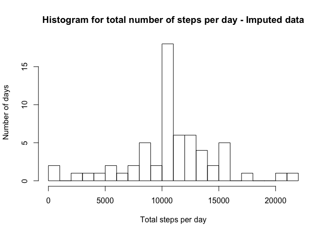

**Introduction**

It is now possible to collect a large amount of data about personal movement using activity monitoring devices such as a Fitbit, Nike Fuelband, or Jawbone Up. These type of devices are part of the “quantified self” movement – a group of enthusiasts who take measurements about themselves regularly to improve their health, to find patterns in their behavior, or because they are tech geeks. But these data remain under-utilized both because the raw data are hard to obtain and there is a lack of statistical methods and software for processing and interpreting the data.

This assignment makes use of data from a personal activity monitoring device. This device collects data at 5 minute intervals through out the day. The data consists of two months of data from an anonymous individual collected during the months of October and November, 2012 and include the number of steps taken in 5 minute intervals each day.

The data for this assignment is part of Git hub repository.


## Loading and preprocessing the data

In this section we will load and preprocess the date, first we will start with loading the required libraries.


```r
library(ggplot2)
library(dplyr)
```
Below code chunk descries the steps to load the data and update the date variable of our data from factor to Date class.


```r
destfile="activity.zip"
if (file.exists(destfile)) {
    unzip(destfile)
}

activity <- read.csv("activity.csv")
activity$date <- as.Date(activity$date, "%Y-%m-%d")
```


## What is mean total number of steps taken per day?

For the first step to answer this question we will calcualte the total number of steps taken per day and store it in a variable.


```r
t_steps <- summarize(group_by(activity, date), total_step=sum(steps,na.rm = TRUE))
```

Let's plot this to a histogram showing frequency i.e. number of days and total steps in a day.


```r
hist(t_steps$total_step, breaks = 20,main = "Histogram for total number of steps per day",xlab = "Total steps per day", ylab = "Number of days")
```

<!-- -->

Calculating the mean and median of of the total number of steps taken per day.


```r
t_steps_mean <- mean(t_steps$total_step)
t_steps_median <- median(t_steps$total_step)
```

**The mean of the total number of steps taken per day is 9354.2295082 and median is
10395.**

## What is the average daily activity pattern?

Below code will summarize the average steps taken for each 5-minutes interval in all days.


```r
average_steps <- summarize(group_by(activity, interval), avg_step=mean(steps,na.rm = TRUE))
```

Plotting this data below so our question can be answered.


```r
plot(average_steps$interval, average_steps$avg_step, type="l", main = "Steps taken per interval averaged across all days", xlab = "Internval", ylab = "Average steps")
```

<!-- -->

**Plot shows the maximum number of steps were taken in interval between 750 to 900, averages across all days.  Interval 835 to be precise.**

## Imputing missing values

Below will calcualte the total number of missing values in the dataset.


```r
missing_col <- apply(apply(activity, 1:2, is.na),2,sum)
missing_total <- sum(missing_col)
missing_col
```

```
##    steps     date interval 
##     2304        0        0
```

Above shows that values are only missing from steps variable and total missing values are 2304.

We will use the average steps for each interval, calcualted in previous section, to impute the missing values and create new dataset.


```r
for(x in 1:nrow(activity)){
  if (is.na(activity[x,1])){
    interval <- activity[x,3]
    activity[x,1] <- as.integer(average_steps[ average_steps[,1]==interval ,2])
  }
}
```

Re-calcualting total number of steps taken per day after imputing the data.


```r
t_steps <- summarize(group_by(activity, date), total_step=sum(steps,na.rm = TRUE))
```

Plot the histogram again showing frequency i.e. number of days and total steps in a day based on imputed data.


```r
hist(t_steps$total_step, breaks = 20,main = "Histogram for total number of steps per day - Imputed data",xlab = "Total steps per day", ylab = "Number of days")
```

<!-- -->

Calculating the mean and median of of the total number of steps taken per day.


```r
t_steps_mean <- mean(t_steps$total_step)
t_steps_median <- median(t_steps$total_step)
```

The mean of the total number of steps taken per day after imputing missing value is 10749.77 and median is 10641.

**As we see the histogram, mean and median values change after imputing the data. In previous histogram we see there were many days (around 10) where total number of steps per day were less than 1000 but after imputing the data we see that there are only around 3 days where total steps per day are less than 1000.**


## Are there differences in activity patterns between weekdays and weekends?

Below will create a new factor variable "week" with two levels and add it to imputed dateset.


```r
activity$week <- sapply(activity$date, weekdays)
activity[ activity$week == "Saturday", 4] <- "weekend" 
activity[ activity$week == "Sunday", 4] <- "weekend"
activity[ activity$week != "weekend", 4] <- "weekday"
activity$week <- factor(activity$week, levels = c("weekday", "weekend"))
```

Below code will summarize the average steps taken for each 5-minutes interval for weekdays and weekend.


```r
average_steps <- summarize(group_by(activity, interval, week), avg_step=mean(steps,na.rm = TRUE))
```

Plotting the average number of steps taken per interval for Weekdays and Weekend.


```r
qplot(data=average_steps, interval, avg_step, geom = "line", facets=week~.,ylab = "Number of Steps")
```

<!-- -->

**Yes, there seems to be some different in the activity patterns between weekdays and weekends.**
